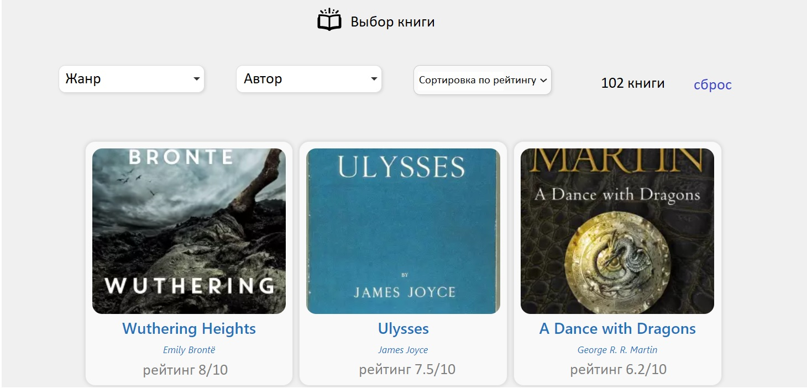

# Требования к проекту
## Содержание

1 [Введение](#intro)  
1.1 [Назначение](#appointment) 
1.2 [Бизнес-требования](#business_requirements)  
1.2.1 [Исходные данные](#initial_data)  
1.2.2 [Возможности бизнеса](#business_opportunities)  
1.2.3 [Границы проекта](#project_boundary) 
1.3 [Аналоги](#analogues)  
1.3.1 [Отличия от аналогов](#analogues_differences)  
2 [Требования пользователя](#user_requirements)  
2.1 [Программные интерфейсы](#software_interfaces)  
2.2 [Интерфейс пользователя](#user_interface)  
2.3 [Характеристики пользователей](#user_specifications)  
2.3.1 [Классы пользователей](#user_classes)  
2.3.2 [Аудитория приложения](#application_audience)  
2.3.2.1 [Целевая аудитория](#target_audience)  
2.3.2.2 [Побочная аудитория](#collateral_audience) 
2.4 [Предположения и зависимости](#assumptions_and_dependencies)  
3 [Системные требования](#system_requirements)  
3.1 [Функциональные требования](#functional_requirements)  
3.1.1 [Основные функции](#main_functions)  
3.1.1.1 [Вход пользователя в приложение](#user_logon_to_the_application)  
3.1.1.2 [Ознакомление с интерфейсом](#wel_interface)  
3.1.1.3 [Выбрать книгу для прочтения](#book_choose)  
3.1.1.4 [Отложить книгу в избранное](#put_book)  
3.1.1.5 [Продолжить чтение](#read_continue)  
3.1.1.6 [Удаление книги Избранное/Текущее](#delete_book)  
3.1.1.7 [Конец чтения](#end_read) 
3.1.1.8 [Выход зарегистрированного пользователя из учётной записи](#exit_reg_user)  
3.1.2 [Ограничения и исключения](#restrictions_and_exclusions) 
3.2 [Нефункциональные требования](#non-functional_requirements)  
3.2.1 [Атрибуты качества](#quality_attributes)  
3.2.1.1 [Требования к удобству использования](#requirements_for_ease_of_use)  
3.2.1.2 [Требования к безопасности](#security_requirements)  
3.2.2 [Внешние интерфейсы](#external_interfaces)  
3.2.3 [Ограничения](#restrictions)  

<a name="intro"/>

# Введение

<a name="appointment"/>

## 1.1 Назначение
Документ разработан для однозначной трактовки требований между разработчиком и заказчиком.  Необходимо разработать десктоп приложение с простым функционалом и актуальной информацией о книгах.
В этом документе описаны функциональные и нефункциональные требования к десктоп приложению «BookLeaner» для Windows. Этот документ предназначен для команды, которая будет реализовывать и проверять корректность работы приложения. 

<a name="business_requirements"/>

## 1.2 Бизнес-требования

<a name="initial_data"/>

### 1.2.1 Исходные данные
В наше время книги в бумажном формате уже теряют актуальность. Поэтому люди разных возрастных категорий используют различные приложения для чтения книг. Также в наше время у человека присутсвует изобилие выбора, поэтому человеку необходимо дать краткий обзор книги. Увидев краткий обзор, а так же некоторые вырезки, биографию автора, человек может понять, что это его книга, либо же наоборот, книга оттолкнет человека. Если человек много читает, он сможет просмотреть уже прочитанные книги, и не тратить лишнее время на то, чтобы вспомнить, была ли прочитана эта книга.

<a name="business_opportunities"/>

### 1.2.2 Возможности бизнеса
Рассеяность людей из-за огромного потока "быстрой" информации, требует введения новых функций в приложения. "Быстрая" информация  повышает избирательность человека, хочется получить весь спектр эмоций уже в первые минуты. Поэтому неотходя от компьютера, человек сможет кратко ознакомиться с книгой, просмотреть картинки в ней, если таковые имеются и ознакомиться с переломнынми моментами в жизни автора. Возможно выше перечисленное зацепит автора и ему будет интересно уделить свое время на прочтение книги.

<a name="project_boundary"/>

### 1.2.3 Границы проекта
Приложение "BookLeaner" позволит существующим и вновь зарегистрированным пользователям делать просмотр: введения книги, биографии автора, рейтинга книги. 

<a name="analogues"/>

# 1.3 Аналоги
Похожие веб-приложения [eBook](https://www.ebooks.com), [Book Analysis](https://bookanalysis.com).

<a name="analogues_differences"/>

## 1.3.1 Отличия от аналогов
Приложение отличается некоторыми функциями и является более узкоспециализированным и направленым на прочтение книг. В приложении будет отсутствовать личный блог и блог обсуждения с другими читателями, потому что приложение акцентирует внимание именно на прочтении книг.

<a name="user_requirements"/>

# 2 Требования пользователя

<a name="software_interfaces"/>

## 2.1 Программные интерфейсы
Продукт должен являться Desktop-приложением и иметь user-friendly интерфейс. Front-end часть должна быть создана средствами HTML/CSS. Серверная часть должна быть написана на Java Servlets API.

<a name="user_interface"/>

## 2.2 Интерфейс пользователя
Окно регистрации нового пользователя.  
  

Окно входа в приложение.  

Главное окно приложения.  
  

Окно выбора книги. 

<a name="user_specifications"/>

## 2.3 Характеристики пользователей

<a name="user_classes"/>

### 2.3.1 Классы пользователей

| Класс пользователей | Описание |
|:---|:---|
| Зарегистрированные пользователи | Пользователи, которые вошли в приложение под своим логином (электронная почта указанная при регистрации), желающие подобрать или продолжить чтение книги.

<a name="application_audience"/>

### 2.3.2 Аудитория приложения

<a name="target_audience"/>

#### 2.3.2.1 Целевая аудитория
Приложение подойдет любым пользователям умеющим читать, включать и запускать приложения.

<a name="collateral_audience"/>

#### 2.3.2.2 Побочная аудитория
Для людей с плохим зрением будет добавлена голосовая диктовка текста.

<a name="business_opportunities"/>

## 2.4 Предположения и зависимости
 Приложение не работает при отсутствии подключения к сети Интернет.
 
<a name="assumptions_and_dependencies"/>

# 3 Системные требования

<a name="functional_requirements"/>

## 3.1 Функциональные требования

<a name="main_functions"/>

### 3.1.1 Основные функции

<a name="user_logon_to_the_application"/>

#### 3.1.1.1 Вход пользователя в приложение
**Описание.** Пользователь имеет возможность использовать приложение только войдя в свою учётную запись. При отсутствии требуется создать.

| Функция | Требования | 
|:---|:---|
| Регистрация нового пользователя | Приложение должно запросить у пользователя ввести электронную почту и пароль для создания учётной записи. Пароль вводится дважды для подтверждения |
| *Пользователь с такой почтой уже существует* | *Приложение должно известить пользователя об ошибке регистрации и запросить ввод электронной почты. Пользователь должен либо ввести новую почту, либо отменить действие* |
| Вход зарегистрированного пользователя в приложение | Приложение должно запросить у пользователя ввести электронную почту, а также пароль|

<a name="wel_interface"/>

#### 3.1.1.2 Ознакомление с интерфейсом
**Описание.** После входа пользователя в приложение имеет возможность ознакомиться с интерфейсом приложения. 

**Требование.** Приложение должно отобразить вводное видео.

<a name="book_choose"/>

#### 3.1.1.3 Выбрать книгу для прочтения
**Описание.** Зарегистрированный пользователь имеет возможность выбрать книгу для прочтения.

<a name="put_book"/>

#### 3.1.1.4 Отложить книгу в избранное
**Описание.** Пользователь имеет возможность отложить книгу в отдельную вкладку "Избранное". Вкладка существует для того, чтобы пользователь не потерял книгу, которую ему хотелось бы прочесть.

<a name="read_continue"/>

#### 3.1.1.5 Продолжить чтение
**Описание.** Пользователь имеет возможность продолжить чтение, выбранной ранее книги.

<a name="delete_book"/>

#### 3.1.1.6 Удаление книги Избранное/Текущее
**Описание.** Пользователь имеет возможность удалить книгу из вкладки "Избранное", либо книгу, которая читается на данный момент.

<a name="end_read"/>

#### 3.1.1.7 Конец чтения
**Описание.** Пользователь имеет возможность просмотреть отчет о своем чтении. Отчет включает в себя, время проведенное за чтением и количество прочитанных страниц. 
**Требование.** Приложение должно предоставить игрокам статистику: количество прочитанных страниц и время чтения.

<a name="exit_reg_user"/>

#### 3.1.1.8 Выход зарегистрированного пользователя из учётной записи
**Описание.** зарегистрированный пользователь имеет возможность выйти из приложения.

**Требование.** Приложение должно предоставить зарегистрированному пользователю возможность выйти из учётной записи с возвратом к окну входа в приложение.

<a name="restrictions_and_exclusions"/>

### 3.1.2 Ограничения и исключения
1. Приложение работает только при наличии подключения к сети Интернет;

<a name="non-functional_requirements"/>

## 3.2 Нефункциональные требования

<a name="quality_attributes"/>

### 3.2.1 Атрибуты качества

<a name="requirements_for_ease_of_use"/>

#### 3.2.1.1 Требования к удобству использования
1. Доступ к основным функциям приложения не более чем за две операции;
2. Все функциональные элементы пользовательского интерфейса имеют названия, описывающие действие, которое произойдет при выборе элемента;
3. Пошаговая инструкция использования основных функций приложения отображена в видео;
4. Понятный графический интерфейс;

<a name="security_requirements"/>

#### 3.2.1.2 Требования к безопасности
Приложение гарантирует безопасность личных данных пользователей.

<a name="external_interfaces"/>

### 3.2.2 Внешние интерфейсы
Окна приложения удобны для использования пользователями с плохим зрением:
  * размер шрифта не менее 14пт.
  * функциональные элементы контрастны фону окна.
  
<a name="restrictions"/>
### 3.2.3 Ограничения
1. Дизайн должен соответствовать пункту интерфейс пользователя.
